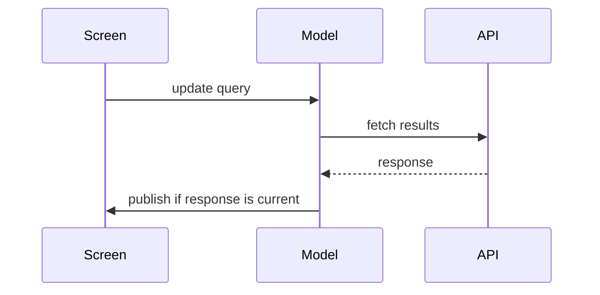

# PR title and body

Give reviewers the change, its proof, and the consequences of landing it.
Use the project's resolved domain glossary and the repository's PR template.
When no template is supplied, use Summary, Evidence, and Merge Danger below.
Keep small PRs brief; the three sections can each be a sentence.

The title names the concrete resulting behavior. In the body, account for what
changed, why, the user/developer effect, root cause for a fix, and verification.
For a stack, identify the immediate parent/base and link adjacent PRs where
available; describe this layer's effect and distinguish dependent work.

```markdown
## Summary
<resulting behavior and why; smallest useful view beside the explanation>

## Evidence
<observed checks and results; before/after when available>

## Merge Danger
<rollback feasibility, affected consumers, and material landing constraints>
```

Follow an existing template's headings and place these facts under its matching
sections. Include only relevant details and support claims with actual evidence.

## Summary: select the useful view

Lead with the behavior a reviewer needs to understand. Use a visual when it
clarifies logic, ownership, or interaction better than the prose alone. Pick the
representation by the question, keeping only the nodes and boundaries that
explain the change:

| What needs explanation | View |
| --- | --- |
| Algorithm or decision logic | Pseudocode |
| Runtime order and responsibility | Call tree |
| UI composition, state ownership, module boundaries | Component/view tree |
| File responsibilities in a broad refactor | Shallow file tree |
| Interactions between services or components | Mermaid sequence or flow diagram |
| Changes to a familiar existing shape | Diff sketch of that shape |
| A mostly new block or a copyable target | Complete, short code or structure block |

A diff sketch can compare UI structure, file layout, call order, or a state
transition. Show unchanged surrounding structure when it explains where the
change belongs. Use the whole small block when cropping would hide ownership
or execution order; include exact code only when it explains a decision.

For example, show the logic that changed:

```diff
 on search(query)
-  publish(await fetchResults(query))
+  generation = startRequest()
+  results = await fetchResults(query)
+  if generation is current
+    publish(results)
```

Or show UI and state ownership when that is the point:

```text
SearchScreen
  SearchModel       # owns request generation and results
  QueryField        # updates the search text
  ResultsList       # displays the current model results
```

For cross-component behavior, show the participants and meaningful ordering:



These are alternative views, not a checklist of diagrams. Place a view next to
its explanation and use several only when each answers a different question.
Distinguish an illustrative sketch from exact implementation code. For a simple
wording or configuration change, clear prose may already be the smallest view.

## Evidence: show the observed result

For a fix, pair the demonstrated failure with the successful result of the same
scenario when available. Identify the test or workflow, command, expected
behavior, and observed output. Link existing logs/artifacts rather than dumping
the whole run. Summarize relevant checks and their results; a passing suite alone
may not explain the behavior the PR fixes.

For visible changes, use `showroom`'s checked screenshots, contact sheets, or
motion proof when available. Pair comparable before/after states and label
which state each artifact shows. For nonvisual behavior, use test results,
terminal output, API responses, or actual workflow observations.

Reuse evidence only while its revision, configuration, and scenario apply to
the described change. Keep local checks distinct from CI and human approval;
label pending, blocked, or unrun checks. When no before-state evidence exists,
say so and show the observed after-state proof. New features can show their
acceptance result without inventing a prior failure. Use supplied or available
evidence, keeping any additional checks within the requested scope. State
missing proof instead of fabricating it to fill the template.

## Merge Danger: explain reversibility and impact

State whether the change can be reversed cheaply (**two-way door**) or whether
landing it can cause effects a code revert cannot recover (**one-way door**).
Explain the actual rollback path or its limits. A normal code revert may be
sufficient; deleting persisted data, rewriting a schema, changing public
contracts, or removing an external resource can require restoration or a
coordinated rollout. Classify the actual consequence, not the size of the diff.

Name the **blast radius** in concrete terms: affected users, platforms,
consumers, data, or dependent stack layers. Include evidenced consequences such
as layout changes, client compatibility, configuration rollout, background work,
or schema readers. Describe any ordering, deployment, or restoration requirement
that matters to landing. Separate demonstrated impact from unresolved assumptions;
use `change-safety` when an uncertain contract warrants that assessment.

For a small reversible change, a short statement of rollback and scope is enough.
For a destructive migration, explain the irreversible effect and restoration
prerequisites even if every test passes. Prefer meaningful scope to an unsupported
one-word risk rating. Keep this section about the concrete PR's consequences.
